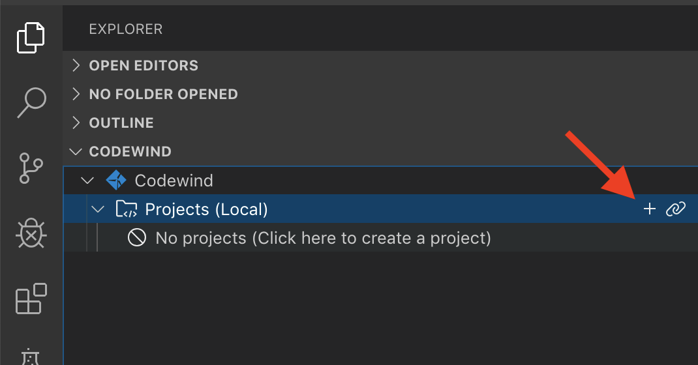
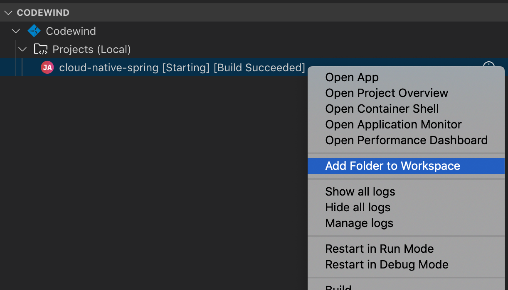

# Spring Appsody Codewind Quicklab

Organizations are moving to the cloud and that is creating a lot of demand for developers to learn new technologies. Creating a "Cloud Native" application requires developers to learn about containers (e.g. Docker) and platforms like Kubernetes. These are very complex technologies, so what are developers to do while still needing to develop applications that deliver business value? 

In this quicklab we will take a look at a Appsody and Codewind and how they can help developers be more productive. Appsody is a command line to for creating, building, and deploying cloud native applications. Eclipse Codewind is a IDE plugin that integrates with your existing workflow allowing you to develop cloud native applications just like how you were building applications before. 

Appsody and Codewind allow developers to start building cloud native applications like an expert without having to be an expert in all the cloud native technologies. 

## Prerequistes

Only needed if running steps on own machine

<details>
  <summary>Click to expand</summary>
  
### Configure Local System

This quicklab will require several command-line tools to be completed, you will need to have all the following installed. It is also generally recommended to have the most recent versions of these tools: 

1. Install Docker
2. Install minikube
3. Install Appsody
4. Install VS Code
5. 	Install codewind extension
6. Install java extension


</details>

## Getting Familiar with Appsody

[Appsody](https://appsody.dev/) is a command-line interface for creating, building, and deploying cloud native projects. Let's look at how to use Appsody to initialize a Spring Boot project. 

Appsody uses a concept called "stacks" that are templates to define how a project should be initialized, how it's Docker image should be built, and define how it should be deployed on a kubernetes cluster. To view available stacks run the following command:

```
$ appsody list
```

This prints out a list of available stacks including the repo they are being pulled from, their version, and the different types of templates. For example `java-spring-boot2` could be initialized as either a Java application "default" or a Kotlin application.

```
REPO        	ID                       	VERSION  	TEMPLATES        	DESCRIPTION                                              
appsodyhub  	java-microprofile        	0.2.12   	*default         	Eclipse MicroProfile on Open Liberty & OpenJ9 using Maven
appsodyhub  	java-spring-boot2        	0.3.10   	*default, kotlin 	Spring Boot using OpenJ9 and Maven                       
appsodyhub  	nodejs                   	0.2.5    	*simple          	Runtime for Node.js applications                         
appsodyhub  	nodejs-express           	0.2.5    	*simple, skaffold	Express web framework for Node.js                        
appsodyhub  	nodejs-loopback          	0.1.4    	*scaffold        	LoopBack 4 API Framework for Node.js                     
appsodyhub  	python-flask             	0.1.3    	*simple          	Flask web Framework for Python                           
appsodyhub  	swift                    	0.1.4    	*simple          	Runtime for Swift applications                           
experimental	java-spring-boot2-liberty	0.1.7    	*default         	Spring Boot on Open Liberty & OpenJ9 using Maven         
experimental	nodejs-functions         	0.1.3    	*simple          	Serverless runtime for Node.js functions                 
experimental	quarkus                  	0.1.5    	*default         	Quarkus runtime for running Java applications            
experimental	vertx                    	0.1.1    	*default         	Eclipse Vert.x runtime for running Java applications   
```

Organizations will have their own specific needs and requirements. For which custom stacks can be created, however Appsody has several pre-defined stacks as well. To view available stacks run this command:

``` 
appsody repo add incubator https://raw.githubusercontent.com/seabaylea/stacks/javametrics-dev/index.yaml
```

## Improving Developer Productivity with Eclipse Codewind

[Eclipse Codewind](https://www.eclipse.org/codewind/) is also an open source project that is part of Kabanero. Codewind is a plugin for IDEs, currently available in VS Code, Eclipse, and Eclipse Che, that helps improve developer productivity when developing . Let's explore how Codewind can help you be a more productive developer.

1. Open VS Code (press **command** + **space bar** and type "VS Code" into the dialog box)
2. In the explorer window under **CODEWIND** click on the "**+**" to create a new project
	
3. In the dialog pop-up search for "Spring template" and select the "Spring template" option	
4. Enter **codewind-spring** as the project name and hit enter
	

### Automated Code Reload

A key to increasing developer productivity is shortening and reducing the friction in the feedback loop. Having to manually run `mvn package` and `docker build` every time you want to verify and change to your application is time consuming and distracting. When appsody detects a change in a running application, it will automatically rebuild and redeploy the application.  

Let's look at this feature in action.

3. In VS Code add the **cloud-native-spring** project folder to the explorer
	
4. 	In the project under **src/main/java/application** create a new file **Hello.java**
5. Edit **Hello.java** to look like below:
	
	```java
	package application;
	
	import org.springframework.web.bind.annotation.RequestMapping;
	import org.springframework.web.bind.annotation.RestController;
	import org.springframework.web.bind.annotation.RequestParam;
	import org.springframework.http.HttpStatus;
	import org.springframework.http.ResponseEntity;
	import org.springframework.web.bind.annotation.ResponseBody;
	import java.util.ArrayList;
	import java.util.List;
	
	@RestController
	public class Hello {
	
	    @RequestMapping("v1/hello")
	    public @ResponseBody ResponseEntity<String> example(@RequestParam("name") String name) {
	        List<String> list = new ArrayList<>();
	        //return a simple list of strings
	        String msg = "Hello " + name;
	        list.add(msg);
	        System.out.println("New message: " + msg);
	        return new ResponseEntity<String>(list.toString(), HttpStatus.OK);
	    }
	
	}
	```
6. You can view the status of the re-build and re-deploy by looking at the status indictaor next to the project under the Codewind context. Once status returnss to [Running][Build Suceeded] you can refresh your browser window to view the change we made. 
		
1. In VS Code click the "go to application" icon	
2. Append `/v1/hello?name=Oracle Code One` to the end of the url

### Viewing Application Logs

Viewing the logs of your application running in a docker container is easy from the IDE with Codewind. 

To view the logs for an application, right click on it and select "Show All Logs" 


The logs for the running application will be shown in the IDE console log window on the bottom right of the page. 

### Deploying an Application to Kubernetes with Appsody 

The cloud native world demands developer learn a lot of new skills that traditionally they didn't need understand before. Appsody helps to reduce this learning curve by helping with tasks like deploying to a kubernetes cluster. Let's deploy the application we have been building in this quicklab to a local kubernetes cluster!

1. First we will need to start our minikube cluster:

	```
	minikube start
	```

1. Next we will need to setup docker registry for the local minikube cluster, so that minikube can pull the image we will be sending it in the next step. To do that run the following command:

	```
	eval $(minikube docker-env)
	```

1. To deploy the application we just created to a kubernetes cluster, in this case a locally running instance of [minikube](https://github.com/kubernetes/minikube), run the following command:

	```
	appsody deploy
	``` 

1. Once the deploy has completed, we will need to tell minikube to expose the service, to do this run the following command:

	```
	minikube service spring-cloud-native
	```

Minikube will expose the service and open a browser window allowing you to view the application we just deployed.

Appsody and Codewind help Java developers create, build, and deploy cloud native applications without having to be experts in cloud native development!

